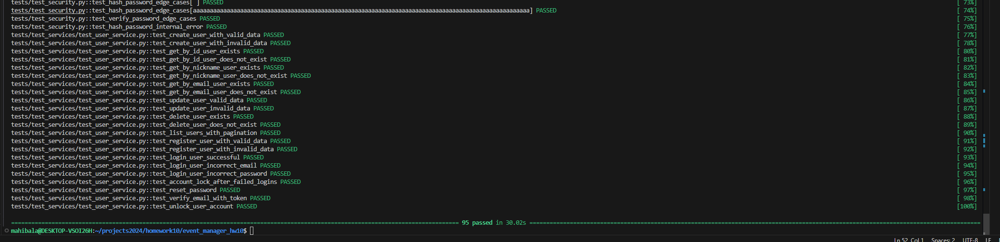
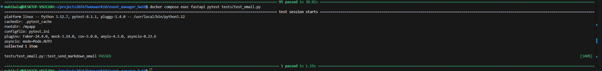
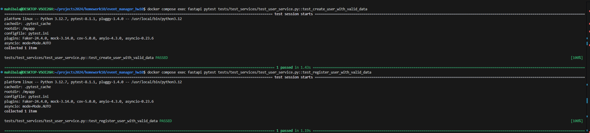
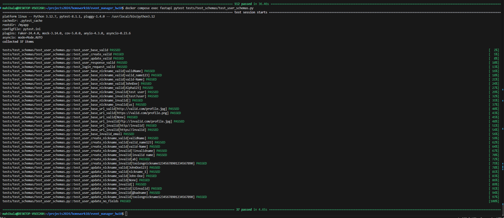
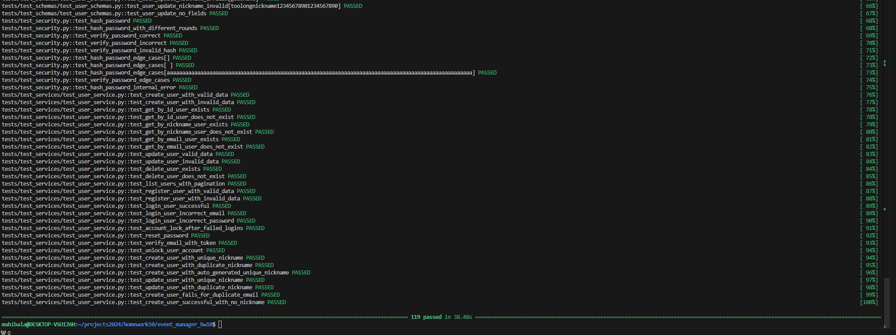
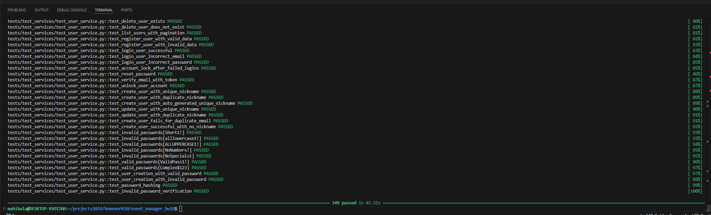

# Event Manager Company: Software QA Analyst/Developer Onboarding Assignment

Welcome to the Event Manager Company! As a newly hired Software QA Analyst/Developer and a student in software engineering, you are embarking on an exciting journey to contribute to our project aimed at developing a secure, robust REST API that supports JWT token-based OAuth2 authentication. This API serves as the backbone of our user management system and will eventually expand to include features for event management and registration.

# Setup and Preliminary Steps

1. **Fork the Project Repository**: Fork the [project repository](https://github.com/yourusername/event_manager) to your own GitHub account. This creates a copy of the repository under your account, allowing you to work on the project independently.

2. **Clone the Forked Repository**: Clone the forked repository to your local machine using the `git clone` command. This creates a local copy of the repository on your computer, enabling you to make changes and run the project locally.
```bash
git clone https://github.com/yourusername/event_manager.git 
```

3. **Verify the Project Setup**: Follow the steps in the instructor video to set up the project using [Docker](https://www.docker.com/). Docker allows you to package the application with all its dependencies into a standardized unit called a container. Verify that you can access the API documentation at `http://localhost/docs` and the database using [PGAdmin](https://www.pgadmin.org/) at `http://localhost:5050`.
```bash
docker-compose up
```
For running pytests:
```bash
docker compose exec fastapi pytest tests
```

# Issues

## Issue 1 : Analyze and fix pytest errors

1. **Description**: The project’s test suite is failing when run with pytest. This may be due to:
- Broken or outdated test fixtures.
- Incorrect or missing environment variables.
- Application bugs affecting test outcomes.

2. **Expected Outcome**:
- All pytests to pass successfully

3. **Resolution Steps**:
- Identified the failing tests by running the below
```bash
docker compose exec fastapi pytest tests
```
- Issue with test_users_api was mainly due to the missing fixtures in conftest.py
- Added the missing token fixtures to the conftest.py
- Identified issues with tests not matching the pydantic model specifications
- Modified conftest.py to match the pydantic model expectations
- Found issue with SMTP server not configured for email testing, Raised an Issue
- Fixed all the identified and reran tests

4. **Tests**:
Reran the tests using the below
```bash
docker compose exec fastapi pytest tests
```


## Issue 2 : Fix SMTP Server Configuration Issues

1. **Description**: The project uses an SMTP server for email functionality, and there are configuration issues preventing successful email testing. Tests are trying to connect to an SMTP server, but the server is either unavailable or not set up correctly for testing.

FAILED tests/test_email.py::test_send_markdown_email - smtplib.SMTPServerDisconnected: Connection unexpectedly closed
FAILED tests/test_services/test_user_service.py::test_create_user_with_valid_data - smtplib.SMTPServerDisconnected: Connection unexpectedly closed
FAILED tests/test_services/test_user_service.py::test_register_user_with_valid_data - smtplib.SMTPServerDisconnected: Connection unexpectedly closed

2. **Expected Outcome**:
The project is to be configured to send test emails using Mailtrap, enabling smoother development and debugging. run pytests that were failing due to SMTP issues and ensure successful run.

3. **Resolution Steps**: 
Setting up Mailtrap to enable local email testing will resolve the issue.

- Set Up a Mailtrap Account
Go to Mailtrap and create an account if you don’t have one.
After logging in: Create a new inbox or use the default one.
Copy the SMTP credentials (host, port, username, password)

- Configure the .env file for the below
smtp_server=
smtp_port=
smtp_username=
smtp_password=

- Rerun pytests to verify email functionality

- Check Mailtrap Inbox: Log in to Mailtrap and verify that emails appear in the specified inbox.

4. **Tests**:
- Test Email Service

- Test User Service


## Issue 3 : Enhance Username Validation

1. **Description**: The current nickname validation allows underscores and hyphens. However, additional constraints are required:

- The nickname should not start with a number.
- Maximum length of 30 characters.
- Allow only alphanumeric characters, underscores (_), and hyphens (-).

2. **Expected Outcome**:

- Valid Nicknames: Nicknames such as john_doe, Test-User, and username123 should be accepted during user creation or update.
- Invalid Nicknames: Nicknames like 123username, invalid!, or toolong_nickname_that_exceeds_30_chars should be rejected.
- Validation Error Messages: Users attempting to create or update nicknames with invalid formats should get an error

3. **Resolution Steps**: 

- Added a helper function validate_nickname in user_schemas.py to encapsulate nickname validation logic
- Applied the validate_nickname function to relevant fields in UserBase, UserResponse and UserUpdate schemas using Pydantic validators. Added a @validator("nickname") decorator for runtime validation.
- Updated Tests - Extended test cases in tests/test_schemas/test_user_schemas.py to cover valid and invalid nickname scenarios

4. **Tests**:
Reran the tests using the below and the entire pytests, all ran successfully.
```bash
docker compose exec fastapi pytest tests/test_schemas/test_user_schemas.py
```


## Issue 4 : Ensure Username Uniqueness

1. **Description**: The system must ensure that every username (or nickname) within the application is unique. When creating or updating a user, duplicate nicknames must be prevented. Failure to enforce this uniqueness can lead to conflicting user profiles, incorrect authentication behavior, and poor user experience.

2. **Expected Outcome**:

- User Creation: If a user attempts to register with a nickname already in use, the API should return a 400 Bad Request error with an appropriate error message ("Nickname already exists"). A unique nickname should be auto-generated if none is provided during registration.
- User Update: If an update includes a duplicate nickname, the API should reject the request with a 400 Bad Request error. If the nickname belongs to the user making the update, it should allow the operation.
- Database Enforcement: The nickname field in the database must be unique, ensuring no duplicates can exist at the database level. This was already implemented.

3. **Resolution Steps**: 

- In the UserService.create method: Check if the nickname exists before creating a new user. If a duplicate is found, log the error and return a 400 error.
- In the UserService.update method: Ensure the new nickname doesn’t belong to another user. Allow the operation if the nickname belongs to the same user being updated.
- Adjust API Endpoints: User Creation: Validate nickname uniqueness and return an appropriate error response if a duplicate is detected. User Update: Ensure nickname uniqueness before applying updates.

4. **Tests**:
Reran the tests using the below and the entire pytests, all ran successfully.
```bash
docker compose exec fastapi pytest tests
```


## Issue 4 : Enhance Password Validation

1. **Description**: Implement robust password validation mechanisms to ensure adherence to security best practices. This includes:

- Enforcing a minimum password length.
- Requiring complexity in passwords, such as a mix of uppercase letters, lowercase letters, numbers, and special characters.
- Properly hashing passwords before storing them in the database.
- This enhancement protects user accounts by mitigating the risk of unauthorized access and enhances the overall security of the application.

2. **Expected Outcome**: All tests to ensure the below enhanced password validation logic should pass.

To enhance security, all user passwords must meet the following criteria:
- **Minimum Length**: Password must be at least 8 characters long.
- **Uppercase Letters**: Password must contain at least one uppercase letter (A-Z).
- **Lowercase Letters**: Password must contain at least one lowercase letter (a-z).
- **Digits**: Password must contain at least one numeric digit (0-9).
- **Special Characters**: Password must include at least one special character (!@#$%^&*(), etc.).
- **No Spaces**: Password must not contain spaces.

### Example

| Password          | Validity    | Reason                                     |
|-------------------|-------------|--------------------------------------------|
| `StrongPass1!`    | ✅ Valid    | Meets all criteria                         |
| `short1!`         | ❌ Invalid  | Less than 8 characters                     |
| `alllowercase1!`  | ❌ Invalid  | Missing an uppercase letter                |
| `ALLUPPERCASE1!`  | ❌ Invalid  | Missing a lowercase letter                 |
| `NoNumbers!`      | ❌ Invalid  | Missing a digit                            |
| `NoSpecials1`     | ❌ Invalid  | Missing a special character                |
| `Has Space1!`     | ❌ Invalid  | Contains spaces                            |

- Error Handling: Informative error messages are displayed when a password fails validation.

- Secure Storage: Passwords are hashed using a strong algorithm (e.g., bcrypt) before being stored in the database.

3. **Resolution Steps**: 

- Updated the validate_password function in app/utils/security.py to enforce stricter rules (minimum length, special characters, uppercase, lowercase, and numeric digits).

4. **Tests**:
Reran the tests using the below and the entire pytests, all ran successfully.
```bash
docker compose exec fastapi pytest tests
```

