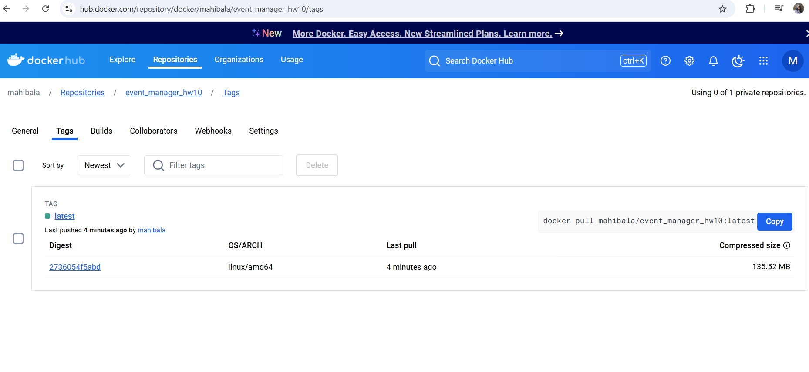
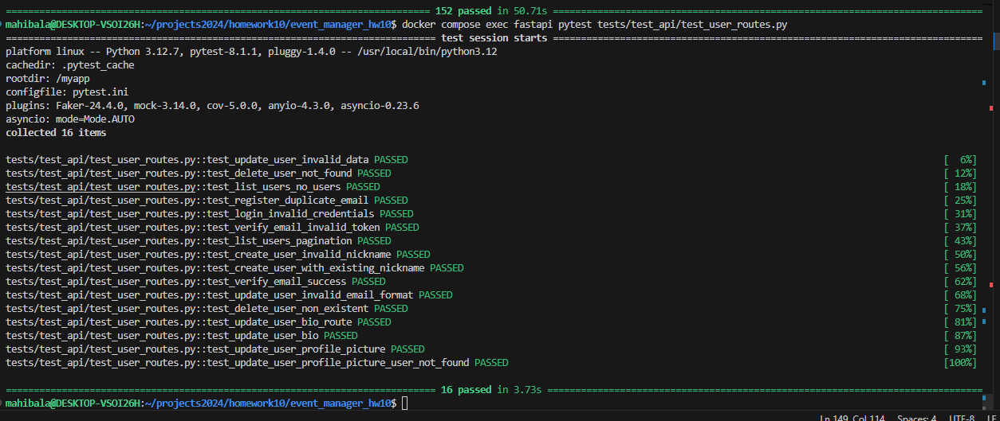
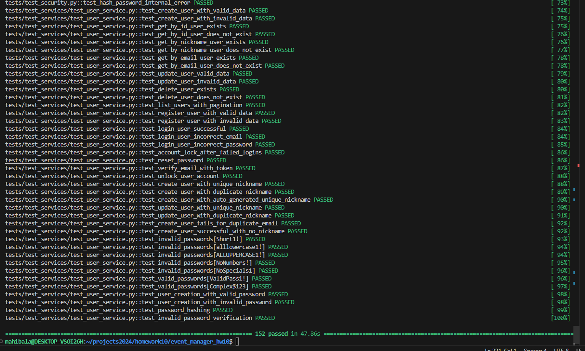

# Event Manager Company: Software QA Analyst/Developer Onboarding Assignment

Welcome to the Event Manager Company! As a newly hired Software QA Analyst/Developer and a student in software engineering, you are embarking on an exciting journey to contribute to our project aimed at developing a secure, robust REST API that supports JWT token-based OAuth2 authentication. This API serves as the backbone of our user management system and will eventually expand to include features for event management and registration.

# Setup and Preliminary Steps

1. **Fork the Project Repository**: Fork the [project repository](https://github.com/yourusername/event_manager) to your own GitHub account. This creates a copy of the repository under your account, allowing you to work on the project independently.

2. **Clone the Forked Repository**: Clone the forked repository to your local machine using the `git clone` command. This creates a local copy of the repository on your computer, enabling you to make changes and run the project locally.
```bash
git clone https://github.com/yourusername/event_manager.git 
```

3. **Verify the Project Setup**: Follow the steps in the instructor video to set up the project using [Docker](https://www.docker.com/). Docker allows you to package the application with all its dependencies into a standardized unit called a container. Verify that you can access the API documentation at `http://localhost/docs` and the database using [PGAdmin](https://www.pgadmin.org/) at `http://localhost:5050`.
```bash
docker-compose up
```
For running pytests:
```bash
docker compose exec fastapi pytest tests
```

# Links to Closed Issues
  
## Closed Issues
Below are the links to the closed issues that provide insights into the work done for this project:
Details related to each issue can be found below in another section

1. [Analyze and Fix Pytest Errors](https://github.com/mahibala-njit/event_manager_hw10/issues/1)
2. [Fix SMTP Server Configuration Issues](https://github.com/mahibala-njit/event_manager_hw10/issues/2)
3. [Enhance Username Validation](https://github.com/mahibala-njit/event_manager_hw10/issues/4)
4. [Ensure Username Uniqueness](https://github.com/mahibala-njit/event_manager_hw10/issues/6)
5. [Enhance Password Validation](https://github.com/mahibala-njit/event_manager_hw10/issues/8)
6. [Edge Cases for Updating Profile Fields](https://github.com/mahibala-njit/event_manager_hw10/issues/10)
7. [Issue with Authorize using Swagger](https://github.com/mahibala-njit/event_manager_hw10/issues/11)


# Link to the Docker Image

## Docker Image

The project has been deployed as a Docker image for easy containerized setup. You can find the image on DockerHub:

[HW10 Event Manager Docker Image](https://hub.docker.com/repository/docker/mahibala/event_manager_hw10/tags)

# Link to the Docker Image



# Reflection Section

## Reflection
This assignment provided a comprehensive experience in building, enhancing, and maintaining a robust API application using FastAPI, Docker, and GitHub workflows. It required not only technical expertise but also an understanding of collaborative development processes, testing strategies, and DevOps workflows.

One of the key takeaways was the ability to identify and resolve issues systematically. The process of creating issues, documenting them, and implementing solutions gave me a structured approach to problem-solving. I enhanced my understanding of FastAPI by implementing new endpoints and improving existing ones, such as handling edge cases for user profile updates and ensuring robust authentication and authorization mechanisms. This required a detailed focus on validation logic, efficient database interactions, and seamless API design.

A significant challenge was ensuring that all test cases passed successfully after making changes to the codebase. Writing meaningful test cases to cover edge scenarios and debugging test failures improved my proficiency with pytest. Additionally, integrating Docker for containerization and pushing images to DockerHub provided insights into modern DevOps practices, reinforcing the importance of reproducibility and portability in application development.

Through this assignment, I also gained a deeper appreciation for collaborative development workflows. Resolving merge conflicts, following Git best practices, and ensuring clear commit messages were integral to maintaining a clean and understandable codebase. Documenting issues and solutions helped me communicate effectively and laid the groundwork for future maintenance.

Overall, this project enhanced my technical skills in API development and testing while giving me hands-on experience with project management and team collaboration in a software development lifecycle.

# Issue Details

## Issue 1 : Analyze and fix pytest errors

1. **Description**: The project’s test suite is failing when run with pytest. This may be due to:
- Broken or outdated test fixtures.
- Incorrect or missing environment variables.
- Application bugs affecting test outcomes.

2. **Expected Outcome**:
- All pytests to pass successfully

3. **Resolution Steps**:
- Identified the failing tests by running the below
```bash
docker compose exec fastapi pytest tests
```
- Issue with test_users_api was mainly due to the missing fixtures in conftest.py
- Added the missing token fixtures to the conftest.py
- Identified issues with tests not matching the pydantic model specifications
- Modified conftest.py to match the pydantic model expectations
- Found issue with SMTP server not configured for email testing, Raised an Issue
- Fixed all the identified and reran tests

4. **Tests**:
Reran the tests using the below
```bash
docker compose exec fastapi pytest tests
```


## Issue 2 : Fix SMTP Server Configuration Issues

1. **Description**: The project uses an SMTP server for email functionality, and there are configuration issues preventing successful email testing. Tests are trying to connect to an SMTP server, but the server is either unavailable or not set up correctly for testing.

FAILED tests/test_email.py::test_send_markdown_email - smtplib.SMTPServerDisconnected: Connection unexpectedly closed
FAILED tests/test_services/test_user_service.py::test_create_user_with_valid_data - smtplib.SMTPServerDisconnected: Connection unexpectedly closed
FAILED tests/test_services/test_user_service.py::test_register_user_with_valid_data - smtplib.SMTPServerDisconnected: Connection unexpectedly closed

2. **Expected Outcome**:
The project is to be configured to send test emails using Mailtrap, enabling smoother development and debugging. run pytests that were failing due to SMTP issues and ensure successful run.

3. **Resolution Steps**: 
Setting up Mailtrap to enable local email testing will resolve the issue.

- Set Up a Mailtrap Account
Go to Mailtrap and create an account if you don’t have one.
After logging in: Create a new inbox or use the default one.
Copy the SMTP credentials (host, port, username, password)

- Configure the .env file for the below
smtp_server=
smtp_port=
smtp_username=
smtp_password=

- Rerun pytests to verify email functionality

- Check Mailtrap Inbox: Log in to Mailtrap and verify that emails appear in the specified inbox.

4. **Tests**:
- Test Email Service

- Test User Service


## Issue 3 : Enhance Username Validation

1. **Description**: The current nickname validation allows underscores and hyphens. However, additional constraints are required:

- The nickname should not start with a number.
- Maximum length of 30 characters.
- Allow only alphanumeric characters, underscores (_), and hyphens (-).

2. **Expected Outcome**:

- Valid Nicknames: Nicknames such as john_doe, Test-User, and username123 should be accepted during user creation or update.
- Invalid Nicknames: Nicknames like 123username, invalid!, or toolong_nickname_that_exceeds_30_chars should be rejected.
- Validation Error Messages: Users attempting to create or update nicknames with invalid formats should get an error

3. **Resolution Steps**: 

- Added a helper function validate_nickname in user_schemas.py to encapsulate nickname validation logic
- Applied the validate_nickname function to relevant fields in UserBase, UserResponse and UserUpdate schemas using Pydantic validators. Added a @validator("nickname") decorator for runtime validation.
- Updated Tests - Extended test cases in tests/test_schemas/test_user_schemas.py to cover valid and invalid nickname scenarios

4. **Tests**:
Reran the tests using the below and the entire pytests, all ran successfully.
```bash
docker compose exec fastapi pytest tests/test_schemas/test_user_schemas.py
```


## Issue 4 : Ensure Username Uniqueness

1. **Description**: While enhancing the validation for usernames (nicknames), it was noted that the system did not enforce uniqueness. This could lead to duplicate usernames in the database, which could cause confusion, security concerns, or data integrity issues.

2. **Expected Outcome**:

- The system should prevent duplicate nicknames at both the application and database levels.
- Any attempt to create or update a user with a duplicate nickname should result in an appropriate error message.

3. **Resolution Steps**: 

- Modified user_routes.py, user_schemas.py and user_service.py to make sure the uniqueness checks related logic are added

4. **Tests**:
Reran the tests using the below and the entire pytests, all ran successfully.
```bash
docker compose exec fastapi pytest tests/test_schemas/test_user_schemas.py
```


## Issue 5 : Enhance Password Validation

1. **Description**: Implement robust password validation mechanisms to ensure adherence to security best practices. This includes:

- Enforcing a minimum password length.
- Requiring complexity in passwords, such as a mix of uppercase letters, lowercase letters, numbers, and special characters.
- Properly hashing passwords before storing them in the database.
- This enhancement protects user accounts by mitigating the risk of unauthorized access and enhances the overall security of the application.

2. **Expected Outcome**: All tests to ensure the below enhanced password validation logic should pass.

To enhance security, all user passwords must meet the following criteria:
- **Minimum Length**: Password must be at least 8 characters long.
- **Uppercase Letters**: Password must contain at least one uppercase letter (A-Z).
- **Lowercase Letters**: Password must contain at least one lowercase letter (a-z).
- **Digits**: Password must contain at least one numeric digit (0-9).
- **Special Characters**: Password must include at least one special character (!@#$%^&*(), etc.).
- **No Spaces**: Password must not contain spaces.

### Example

| Password          | Validity    | Reason                                     |
|-------------------|-------------|--------------------------------------------|
| `StrongPass1!`    | ✅ Valid    | Meets all criteria                         |
| `short1!`         | ❌ Invalid  | Less than 8 characters                     |
| `alllowercase1!`  | ❌ Invalid  | Missing an uppercase letter                |
| `ALLUPPERCASE1!`  | ❌ Invalid  | Missing a lowercase letter                 |
| `NoNumbers!`      | ❌ Invalid  | Missing a digit                            |
| `NoSpecials1`     | ❌ Invalid  | Missing a special character                |
| `Has Space1!`     | ❌ Invalid  | Contains spaces                            |

- Error Handling: Informative error messages are displayed when a password fails validation.

- Secure Storage: Passwords are hashed using a strong algorithm (e.g., bcrypt) before being stored in the database.

3. **Resolution Steps**: 

- Updated the validate_password function in app/utils/security.py to enforce stricter rules (minimum length, special characters, uppercase, lowercase, and numeric digits).

4. **Tests**:
Reran the tests using the below and the entire pytests, all ran successfully.
```bash
docker compose exec fastapi pytest tests
```


## Issue 6 : Edge Cases for Updating Profile Fields

1. **Description**:  Application lacked dedicated endpoints for updating specific user profile fields like bio and profile_picture_url, so this can give the flexibility to just update the relevant information. Also ensure below are handled for the endpoints

- Enforce validation for the bio field, ensuring its length does not exceed the specified limit.
- Add validation for profile_picture_url to reject invalid or empty values.
- Restrict access to these updates to authorized roles (ADMIN and MANAGER).
- Return appropriate error responses for invalid input or non-existent users.

2. **Expected Outcome**:

- Provide dedicated PATCH endpoints for individual updates:
        - update_user_bio to update the bio field.
        - update_user_profile_picture to update the profile_picture_url field.
- Validate input for each field:
        - Reject overly long bio values (greater than 500 characters) with a 422 Unprocessable Entity error.
        - Reject invalid or empty profile_picture_url with a 400 Bad Request error.
- Ensure role-based access control, allowing only ADMIN and MANAGER roles to perform updates.
- Return clear and actionable error messages for invalid input or non-existent users.

3. **Resolution Steps**: 

- Patch Endpoints Added : 
    - PATCH /users/{user_id}/bio: For updating the bio field with validation for length and presence.
    - PATCH /users/{user_id}/profile-picture: For updating the profile_picture_url field with validation for presence and format.
- Validation Logic : 
    - Added a 500-character limit check for the bio field.
    - Enforced validation for profile_picture_url to ensure it is non-empty.
- Access Control and Error Handling : 
    - Implemented role-based access control to allow only ADMIN and MANAGER roles to update these fields.
    - Returned appropriate error messages for invalid input or non-existent users.

4. **Tests**:
Add new tests specific to the two endpoints. Run these tests to ensure the new endpoints are working as expected.
```bash
docker compose exec fastapi pytest tests/test_api/test_user_routes.py
```


## Issue 7 : Fix Swagger Authorization and Login Endpoint Issues

1. **Description**: The /login logic in user_routes.py was repeated multiple times, making the code redundant and harder to maintain. Additionally, authenticating as an admin user through Swagger (Authorize button) was not functioning as expected. This created challenges in testing and using the API securely.

2. **Expected Outcome**: All tests to ensure the below enhanced password validation logic should pass.

- Swagger Authorization: Admin users should be able to authenticate successfully via Swagger using the Authorize button.
- Login Endpoint: /login endpoint should handle authentication securely and consistently, without redundant code.
- Tests for the /login endpoint should succeed, ensuring its reliability.

3. **Resolution Steps**: 

- To fix the admin login issue, modified the alembic script to insert an admin record in to the table to make sure there is way to authorize as admin users to test the swagger endpoints
- To make the same working, had to change the user_routes.py to remove the redudancy issues with /login endpoint

4. **Tests**:
Add new tests to test the expected outcome. Run all tests to make sure the code works as expected
```bash
docker compose exec fastapi pytest tests
```

